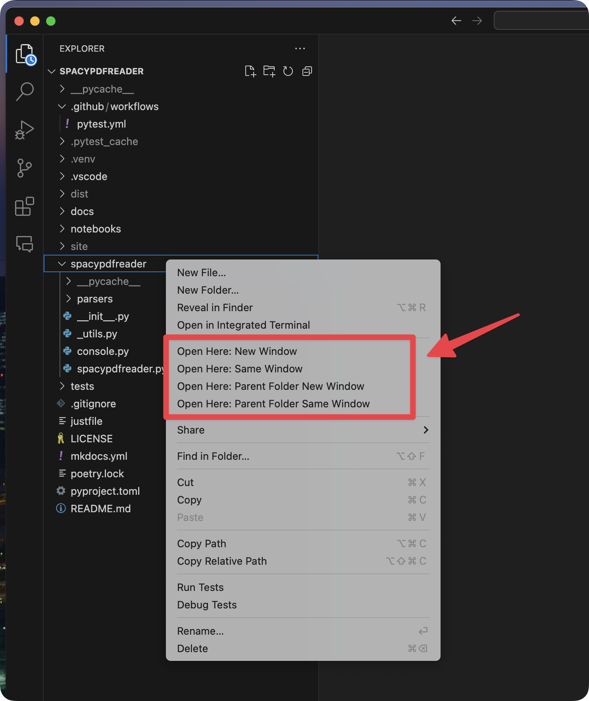

# Right Click Open Here

Open VS Code from the context menu.

## Features

Open or reopen VS Code in specific directories using the context menu in the explorer.



The follow commands are added to the explorer context menu:

- `Open Here: New Window`
- `Open Here: Same Window`
- `Open Here: Parent Folder New Window`
- `Open Here: Parent Folder Same Window`

Two commands are also added to the Command Palette:

- `> Open Here: Open Workspace Parent Folder New Window`
- `> Open Here: Open Workspace Parent Folder Same Window`

## Requirements

None

## Extension Settings

None

## Known Issues

None

## Release Notes

See <https://github.com/SamEdwardes/vscode-extension-right-click-open-here/blob/main/CHANGELOG.md>.

## Contributing

Clone the repo:

```bash
git clone https://github.com/SamEdwardes/vscode-extension-right-click-open-here.git
```

Install the dependencies:

```bash
npm install
```

Lint:

```bash
npm run lint
```

Build the package:

```bash
vsce package
```
